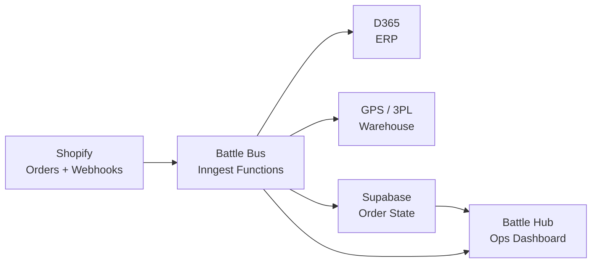
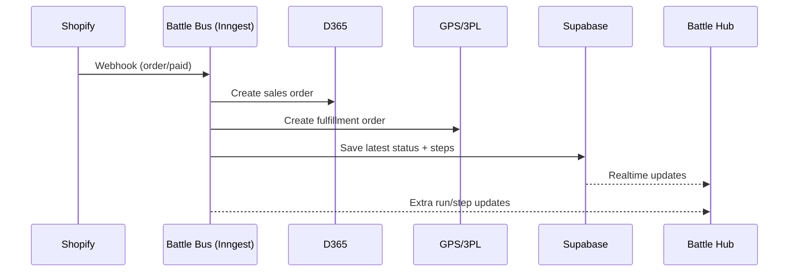

# Simple Architecture Diagram

This is the easiest way to understand the system.

## High-Level View

## What Each Part Does

- `Shopify`: sends order events like create, paid, cancel, refund.
- `Battle Bus (Inngest)`: processes each event step-by-step with retries.
- `D365`: receives sales orders and financial updates.
- `GPS / 3PL`: receives fulfillment orders and returns shipment updates.
- `Supabase`: stores order status, errors, and processing history.
- `Battle Hub`: where Ops/CS sees status, backorders, and retries orders.

## 1-Minute Flow

## Mental Model

- **Battle Bus = engine**
- **Battle Hub = control panel**
